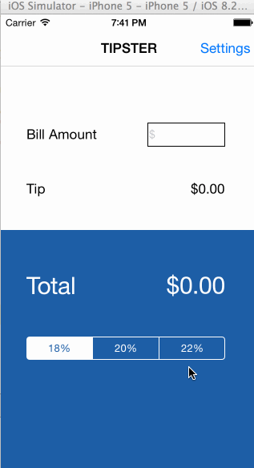

## Description
This is a tipping application that helps you calculate what amount of tip to leave for a bill, given the percentage you pick. It is a project assignment for the CodePath iOS class.

Hours Spent: 4-5 hours

## Stories
* [x] Required: User can calculate the tip amount based on the bill amount and the tip percentage chosen.
* [x] Required: User can access a settings page where he can choose a default tip percentage amount that perists.
* [x] Optional: User can set a custom tip percentage that can be added as the third tip option through the Settings page.

## Video Walkthrough

Note: GIF created with [LiceCap](http://www.cockos.com/licecap/).
